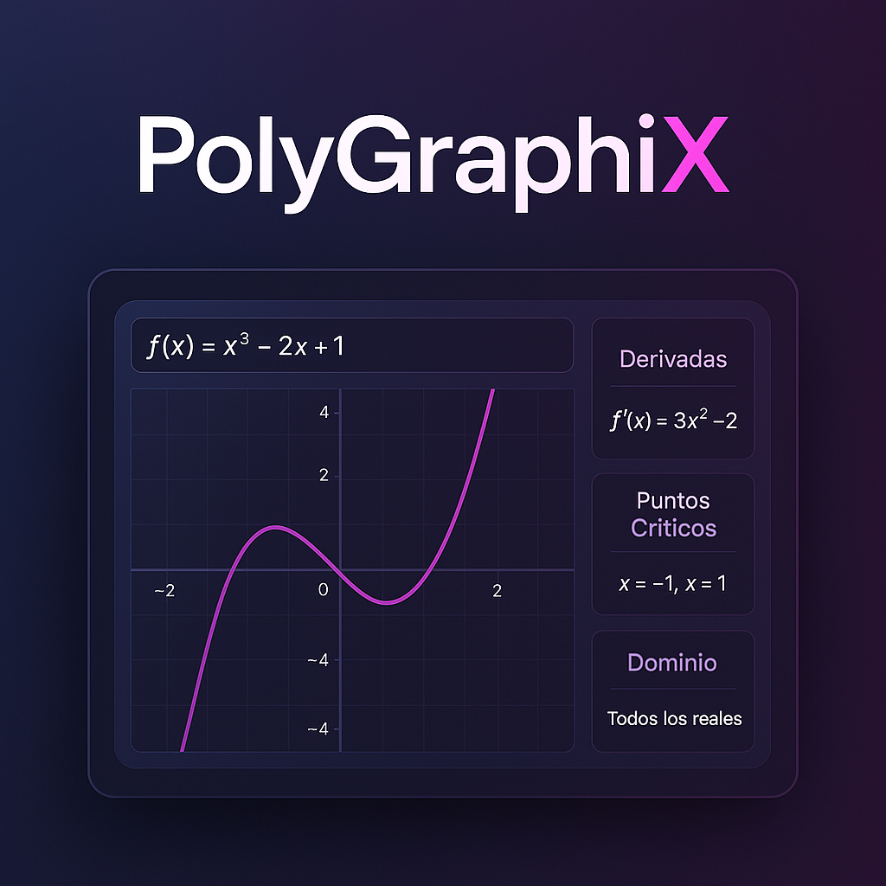
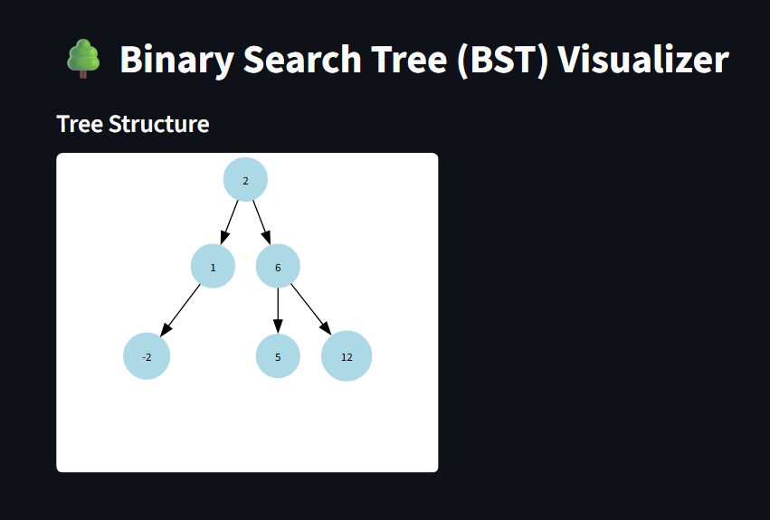
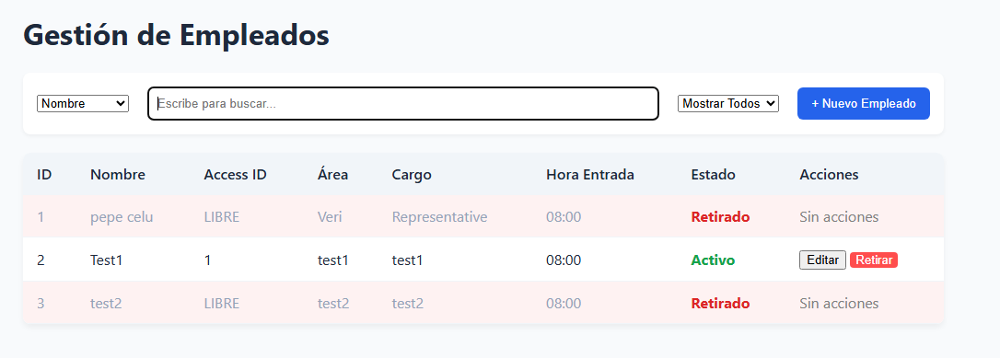
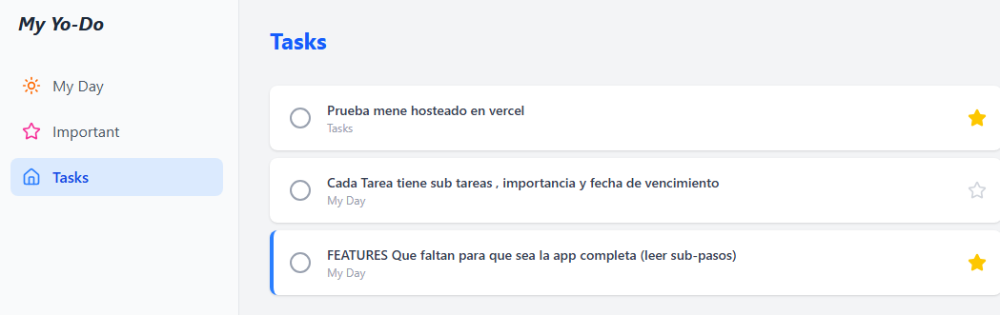

<h1 align="left">Hi 👋, I'm Juan José Meneses</h1>

### 🚀 Entry Software/Data Engineer

- 📊 **Specializing in:** Process automation, data analysis, and operational efficiency.
- 🛠 **Currently Focus:** Universitry And Work **(Data Analyst/Engineer)**. Soon I will make personal open code projects ;)
- 💡 **Technical Stack:** Python (Pandas/FastAPI), Excel automation (VBA/Power Query), and React.
- **Interests:** Video game development, Artificial Intelligence, Automation, Software applications in Biology/Agronomy
- 📍  Medellín, Colombia.

### 🛠 Tech Stack & Tools

  
  
  
  
  
  
  
  
  
  

### 📬 Let's Connect

  
  
  

### 🎓 Featured Educational Projects

---

  <h4>📊 PolyGraphiX</h4>
  
  
Web tool for graphing polynomial functions, derivatives, and critical points.

   

  ---

  <h4>🌲 Binary Tree Visualizer</h4>
  
  
Visualize and understand Binary Search Tree (BST) and Self-Balancing AVL Trees.

   

  ---

  <h4>👥 Employees Manager</h4>
  
  
An employee management system designed for administrative oversight of staff.

   

  ---

  <h4>✅ To Do App</h4>
  
  
A full-stack To-Do app inspired by Microsoft Outlook, built from scratch.

---